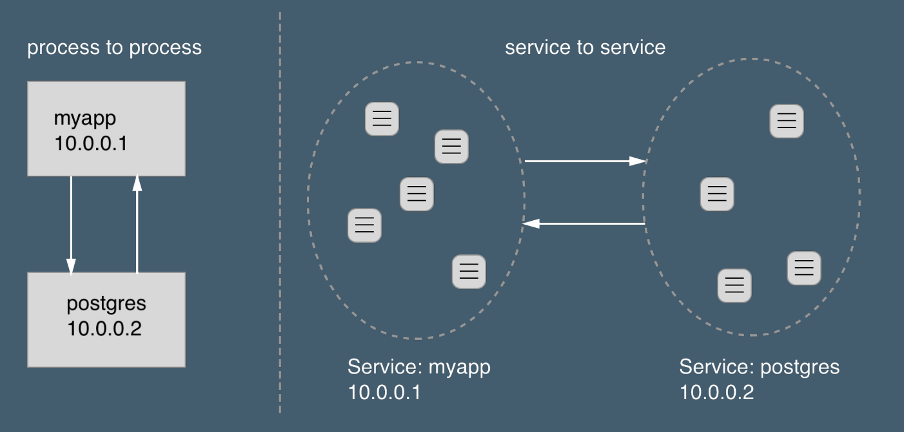

# Docker

## Introduction

Why should I use docker ?

* for testers/hackers :
	* install a complex stack in no time to test your favorite new system. Nothing will be installed directly into your host system.
* for developers : 
	* maintain your dev environment isolated
	* share your work easily
	* archived versions
	* deploy a postgresql, mariadb, redis, rabbitmq, ... to test something quickly 
	* continuous integration : push -> test -> release
* for [devops](https://en.wikipedia.org/wiki/DevOps) :
    * package once, deploy everywhere
    * deploy complexes apps in no time
    * easy scalabily, load-balancing
	* easier and standardized deployment processes (continous deployment)
	* built-in orchestrator (swarm)
* for system admins:
    * simplified / standardised deploy pipelines
    * orchestration
    * security
    
    
Nowaday entreprise needs IT teams to make:

* scalable applications
* well architectured systems (microservices)
* built-in security (process isolation, networks management)

## Get started 

from [docker documentation](https://docs.docker.com/get-started/)

Docker is a platform for developers and sysadmins to **build, share, and run** applications with containers. The use of containers to deploy applications is called containerization. Containers are not new, but their use for easily deploying applications is.

Containerization is increasingly popular because containers are:
 
 * **Flexible**: Even the most complex applications can be containerized.
 * **Lightweight**: Containers leverage and share the host kernel, making them much more efficient in terms of system resources than virtual machines.
 * **Portable**: You can build locally, deploy to the cloud, and run anywhere.
 * **Loosely coupled**: Containers are highly self sufficient and encapsulated, allowing you to replace or upgrade one without disrupting others.
 * **Scalable**: You can increase and automatically distribute container replicas across a datacenter.
 * **Secure**: Containers apply aggressive constraints and isolations to processes without any configuration required on the part of the user.

### Basic concepts

Fundamentally, a container is nothing but a running process, with some added encapsulation features applied to it in order to keep it isolated from the host and from other containers. One of the most important aspects of container isolation is that each container interacts with its own, private filesystem; this filesystem is provided by a Docker **image**.

An image is a **lightweight**, **stand-alone**, executable package that includes everything needed to run a piece of software, including the code, a runtime, libraries, environment variables, and config files.

A container is a runtime instance of an image—what the image becomes in memory when actually executed. It runs **completely isolated** from the host environment by default, only accessing host files and ports if configured to do so.

Containers run apps natively on the host machine’s kernel.

### Container vs virtual machines


Virtual machines run guest operating systems—note the OS layer in each box. This is resource intensive, and the resulting disk image and application state is an entanglement of OS settings, system-installed dependencies, OS security patches, and other easy-to-lose, hard-to-replicate ephemera.


Containers can share a single kernel, and the only information that needs to be in a container image is the executable and its package dependencies, which never need to be installed on the host system. These processes run like native processes, and you can manage them individually by running commands like docker ps—just like you would run ps on Linux to see active processes. Finally, because they contain all their dependencies, there is no configuration entanglement; a containerized app “runs anywhere.”


## Installation

[docker engine installation](https://docs.docker.com/engine/installation/)

```
$ docker --help

...

Management Commands:
  config      Manage Docker configs
  container   Manage containers
  image       Manage images
  network     Manage networks
  node        Manage Swarm nodes
  plugin      Manage plugins
  secret      Manage Docker secrets
  service     Manage services
  stack       Manage Docker stacks
  swarm       Manage Swarm
  system      Manage Docker
  trust       Manage trust on Docker images (experimental)
  volume      Manage volumes

Commands:
  ...

```

## Test your setup

```
docker run hello-world
```

## Images

[Dockerfile reference](https://docs.docker.com/engine/reference/builder/)
[Best practices for writing Dockerfiles](https://docs.docker.com/engine/userguide/eng-image/dockerfile_best-practices/)

```
docker image push <image>
docker image pull <image>
docker image ls
```

### Dockerfile

**Dockerfile** will define what goes on in the environment inside your container. Access to resources like networking interfaces and disk drives is virtualized inside this environment, which is isolated from the rest of your system, so you have to map ports to the outside world, and be specific about what files you want to “copy in” to that environment. However, after doing that, you can expect that the build of your app defined in this Dockerfile **will behave exactly the same wherever it runs**.


### Dockerfile instructions

#### FROM

This instruction is used to set the base image for subsequent instructions. It is mandatory to set this in the first line of a Dockerfile.

### RUN

This instruction lets you execute a command on top of an existing layer and create a new layer with the results of command execution.

```
FROM ubuntu
RUN apt-get update && aupt-get install -y htop
```

### CMD

Specifies the intended command for the image. Whereas RUN actually executes the command during build time.

```
CMD echo "Hello World!"
```

### EXPOSE

Expose a port

```
EXPOSE 80
```

### ENV

This instruction can be used to set the environment variables in the container.

```
ENV UID=1000
```

### COPY

This instruction is used to copy files and directories from a specified source (from build context) to a destination (in the file system of the container).

```
COPY requirements.txt /app/requirements.txt
```

### ADD

This instruction is similar to the COPY instruction with few added features like remote URL support in the source field and local-only tar extraction. But if you don’t need a extra features, it is suggested to use COPY as it is more readable.

```
ADD http://www.site.com/downloads/sample.tar.xz /usr/src
```

### ENTRYPOINT

You can use this instruction to set the primary command for the image.

```
CMD "Hello World!"
ENTRYPOINT echo
```

### VOLUME

You can use the VOLUME instruction to enable access to a location on the host system from a container. Just pass the path of the location to be accessed.

```
VOLUME /data
```

### USER

This is used to set the UID (or username) to use when running the image.

```
USER www-data
```

### Registries

Public vs Private

[docker hub](https://hub.docker.com/explore/)

  * [hello-world](https://hub.docker.com/_/hello-world/): test image
  * os images:
    * [ubuntu](https://hub.docker.com/_/ubuntu/): ubuntu Linux image
    * [debian](https://hub.docker.com/_/debian/): debian Linux image
    * [alpine](https://hub.docker.com/_/alpine/): alpine Linux image
  * application images:
    * [nginx](https://hub.docker.com/_/nginx/)
    * [rabbitmq](https://hub.docker.com/_/rabbitmq/)
    * [maven](https://hub.docker.com/_/maven/)
  * dev images:
    * [python](https://hub.docker.com/_/rabbitmq/)
    * [java](https://hub.docker.com/_/openjdk/)
  * ...


## Network management

[Docker container networking](https://docs.docker.com/engine/userguide/networking/)

[Docker run](https://docs.docker.com/engine/reference/commandline/run/)

[Docker run reference](https://docs.docker.com/engine/reference/run/)

```
$ docker network ls
NETWORK ID          NAME                DRIVER
7fca4eb8c647        bridge              bridge
9f904ee27bf5        none                null
cf03ee007fb4        host                host
```

### Port publishing

[Exposing and publishing ports](https://docs.docker.com/engine/userguide/networking/#exposing-and-publishing-ports)

```
--publish 80:80
--publish 8888:80		# publish port 80 of container to port 8888 ofx
--publish-all 			# randomly publish container exposed ports
```

### Embedded DNS server

[Embedded DNS server in user-defined networks](https://docs.docker.com/engine/userguide/networking/configure-dns/)

[Configure container dns](https://docs.docker.com/engine/userguide/networking/default_network/configure-dns/)

Containers in same networks will be able to communicate using their ip and name.

```
$ docker network create test-network
90b16f25d2d0f55e4a9bcf6942b0b3ef069c136a35f007e4d4c55ea1c1f01ecadocker network create test-network
$ docker run -it --network test-network --name ubuntu1 -d ubuntu:16.04
1665aa117ef08ed8b3d93e8e8ff037a8e64e1048bed705bef9d88a32ff87e6fc
$ docker run --rm -it --network test-network willfarrell/ping ping ubuntu1
PING ubuntu1 (172.28.0.2): 56 data bytes
64 bytes from 172.28.0.2: seq=0 ttl=64 time=0.082 ms
64 bytes from 172.28.0.2: seq=1 ttl=64 time=0.139 ms
64 bytes from 172.28.0.2: seq=2 ttl=64 time=0.155 ms
```

## Volume management

[Manage data in docker](https://docs.docker.com/engine/admin/volumes/)

[Use volumes](https://docs.docker.com/engine/admin/volumes/volumes/)

It is possible to store data within the writable layer of a container, but there are some downsides:
  * The data won’t persist when that container is no longer running, and it can be difficult to get the data out of the container if another process needs it.
  * You can’t easily move the data somewhere else.
  * ...

### Choose right type of mount


  * **Volumes** are stored in a part of the host filesystem which is managed by Docker (/var/lib/docker/volumes/ on Linux). Non-Docker processes should not modify this part of the filesystem. Volumes are the best way to persist data in Docker.
  * **Bind** mounts may be stored anywhere on the host system. They may even be important system files or directories. Non-Docker processes on the Docker host or a Docker container can modify them at any time.
  * **tmpfs** mounts are stored in the host system’s memory only, and are never written to the host system’s filesystem.

[More details about mount types](https://docs.docker.com/engine/admin/volumes/#more-details-about-mount-types)


### Good use cases for volumes

  * Sharing data among multiple running containers. Volumes are only removed when you explicitly remove them.
  * When you want to store your container’s data on a remote host or a cloud provider, rather than locally.


### Good use cases for bind mounts


  * Sharing configuration files from the host machine to containers. This is how Docker provides DNS resolution to containers by default, by mounting /etc/resolv.conf from the host machine into each container.

  * Sharing source code or build artifacts between a development environment on the Docker host and a container.


## Dirty hands

[Docker tutorial containers](https://docs.docker.com/get-started/part2/)

### Setup

Create a dedicated directory and put the following files:

* Dockerfile

```
# Use an official Python runtime as a parent image
FROM python:2.7-slim

# Set the working directory to /app
WORKDIR /app

# Copy the current directory contents into the container at /app
ADD . /app

# Install any needed packages specified in requirements.txt
RUN pip install --trusted-host pypi.python.org -r requirements.txt

# Make port 80 available to the world outside this container
EXPOSE 80

# Define environment variable
ENV NAME World

# Run app.py when the container launches
CMD ["python", "app.py"]
```

* requirements.txt

```
Flask
Redis
```

* app.py 

```python
from flask import Flask
from redis import Redis, RedisError
import os
import socket

# Connect to Redis
redis = Redis(host="redis", db=0, socket_connect_timeout=2, socket_timeout=2)

app = Flask(__name__)

@app.route("/")
def hello():
    try:
        visits = redis.incr("counter")
    except RedisError:
        visits = "<i>cannot connect to Redis, counter disabled</i>"

    html = "<h3>Hello {name}!</h3>" \
           "<b>Hostname:</b> {hostname}<br/>" \
           "<b>Visits:</b> {visits}"
    return html.format(name=os.getenv("NAME", "world"), hostname=socket.gethostname(), visits=visits)

if __name__ == "__main__":
    app.run(host='0.0.0.0', port=80)
```

### Build your image

```
$ ls
Dockerfile		app.py			requirements.txt
$ docker build -t friendlyhello .
$ docker image ls
```

### Run your image

```
$ docker run -p 4000:80 friendlyhello
 * Running on http://0.0.0.0:80/ (Press CTRL+C to quit)
```

Then visit http://localhost:4000

Or use curl :

```
$ curl http://localhost:4000
```

The output should be similar to :

```
Hello World!
Hostname: e64a15d1d468
Visits: cannot connect to Redis, counter disabled
```

### Restart with a redis database

Using embedded docker DNS, we can easily create a redis container and use it in our project.

```
$ docker network create my-project-network
$ docker run -d --network my-project-network --name redis redis
$ docker run --network my-project-network -p 4000:80 friendlyhello
```

You should see something like : 

```
Hello World!
Hostname: 9794fad77d45
Visits: 1
```

### Say hello to someone else

The `app.py` include a special feature, it can say hello to someone else using an environment variable.

```
$ docker run -p 4000:80 -e NAME=Robin friendlyhello
```

```
Hello Robin!
Hostname: 98772c42077a
Visits: cannot connect to Redis, counter disabled
```

### Get logs from a container running in detached mode

```
$ docker run -p 4000:80 --name testlog -d friendlyhello
$ docker logs -f testlog 
 * Running on http://0.0.0.0:80/ (Press CTRL+C to quit)
172.17.0.1 - - [24/Jan/2018 12:10:32] "GET / HTTP/1.1" 200 -
172.17.0.1 - - [24/Jan/2018 12:10:33] "GET / HTTP/1.1" 200 -
172.17.0.1 - - [24/Jan/2018 12:10:34] "GET / HTTP/1.1" 200 -
172.17.0.1 - - [24/Jan/2018 12:10:34] "GET / HTTP/1.1" 200 -
```

# docker-compose

`docker-compose` is a python utility that permit to describe/launch/manage several containers at once on a single host.

## Installation

[Install docker compose](https://docs.docker.com/compose/install/)

```
$ docker-compose -h
Define and run multi-container applications with Docker.

Usage:
  docker-compose [-f <arg>...] [options] [COMMAND] [ARGS...]
  docker-compose -h|--help

...

Commands:
  build              Build or rebuild services
  bundle             Generate a Docker bundle from the Compose file
  config             Validate and view the compose file
  create             Create services
  down               Stop and remove containers, networks, images, and volumes
  events             Receive real time events from containers
  exec               Execute a command in a running container
  help               Get help on a command
  kill               Kill containers
  logs               View output from containers
  pause              Pause services
  port               Print the public port for a port binding
  ps                 List containers
  pull               Pull service images
  push               Push service images
  restart            Restart services
  rm                 Remove stopped containers
  run                Run a one-off command
  scale              Set number of containers for a service
  start              Start services
  stop               Stop services
  top                Display the running processes
  unpause            Unpause services
  up                 Create and start containers
  version            Show the Docker-Compose version information
``` 

## Dirty hands


### Create your first docker-compose stack

Create a `docker-compose.yml` file

```yaml
version: '2'
services:
  web:
    image: friendlyhello
    ports:
      - "4000:80"
  redis:
    image: redis
```

### Deploy it

```
$ docker-compose up
```

### Develop your app with docker-compose stack

```yaml
version: '2'
services:
  web:
    image: friendlyhello
    volumes:
      - ./app.py:/app/app.py
    ports:
      - "4000:80"
  redis:
    image: redis
```

TIP: you need to change your `app.py` file to include flask auto reloading feature : `app.run(host='0.0.0.0', port=80, debug=True)`

You can now edit your `app.py` file and get result in your browser without rebuilding the image.

### Develop your java app with docker-compose


# Docker services

[How services work](https://docs.docker.com/engine/swarm/how-swarm-mode-works/services/)

## Distributed application architecture

Definition: An application consisting of one **or more** processes running on one **or more** nodes.

## Concepts

### Services over processes



### Characteristics & requirements

* Bandwidth and latency
* Ephemeral components
* Stateless versus stateful
* Service discovery
* Load balancing
* Health checking
* Logging and monitoring
* Circuit breakers

### How services work

To deploy an application image when Docker Engine is in swarm mode, you create a service. Frequently a service will be the image for a microservice within the context of some larger application. Examples of services might include an HTTP server, a database, or any other type of executable program that you wish to run in a distributed environment.

When you create a service, you specify which container image to use and which commands to execute inside running containers. You also define options for the service including:

  * the port where the swarm will make the service available outside the swarm
  * an overlay network for the service to connect to other services in the swarm
  * CPU and memory limits and reservations
  * a rolling update policy
  * the number of replicas of the image to run in the swarm

### Services, tasks and containers


## Dirty hands

[Docker tutorial services](https://docs.docker.com/get-started/part2/)

### Setup

Create the `docker-stack.yml` file.

```yaml
version: "3"
services:
  web:
    image: friendlyhello
    deploy:
      replicas: 2
      resources:
        limits:
          cpus: "0.1"
          memory: 50M
      restart_policy:
        condition: on-failure
    ports:
      - "4000:80"
    networks:
      - webnet
networks:
  webnet:
```

### Init the swarm

```
docker swarm init
```

### Deploy your service

```
$ docker stack deploy -c docker-stack.yml friendlyhello
Creating network friendlyhello_webnet
Creating service friendlyhello_web
```

`http://localhost:4000` should output as usual :

```
Hello World!
Hostname: e64a15d1d468
Visits: cannot connect to Redis, counter disabled
```

Refresh the browser several times and you should see that your service is actually running in several containers 


### list services 

```
$ docker service ls
ID                  NAME                          MODE                REPLICAS            IMAGE                       PORTS
31o20ib5hhaa        friendlyhello_web             replicated          2/2                 friendlyhello:latest        *:4000->80/tcp
```

### list containers of a service

```
$ docker service ps friendlyhello_web 
ID                  NAME                  IMAGE                  NODE                DESIRED STATE       CURRENT STATE           ERROR               PORTS
dj7rt17busr3        friendlyhello_web.1   friendlyhello:latest   robin-XPS           Running             Running 6 minutes
f31r54oyzzs5        friendlyhello_web.2   friendlyhello:latest   robin-XPS           Running             Running 6 minutes ago
```

### scale a service

Edit the `docker-stack.yml` file to run 4 replicas of your `web` service, and 

```
$ docker stack deploy -c docker-stack.yml friendlyhello
Updating service friendlyhello_web (id: 31o20ib5hhaa010g22lczquz0)
$ docker service ls
ID                  NAME                          MODE                REPLICAS            IMAGE                       PORTS
31o20ib5hhaa        friendlyhello_web             replicated          **4/4**                 friendlyhello:latest        *:4000->80/tcp
```

### Visualize a swarm

Edit your `docker-stack.yml` file :

```yaml
version: "3"
services:
  web:
    image: friendlyhello
    deploy:
      replicas: 2
      resources:
        limits:
          cpus: "0.1"
          memory: 50M
      restart_policy:
        condition: on-failure
    ports:
      - "4000:80"
    networks:
      - webnet
  visualizer:
    image: dockersamples/visualizer:stable
    ports:
      - "8080:8080"
    volumes:
      - "/var/run/docker.sock:/var/run/docker.sock"
    deploy:
      placement:
        constraints: [node.role == manager]
    networks:
      - webnet
networks:
  webnet:
```

Then, deploy and browse `http://localhost:8080`

```
$ docker stack deploy -c docker-stack.yml friendlyhello
```

### More readings

  * docker overlay network
